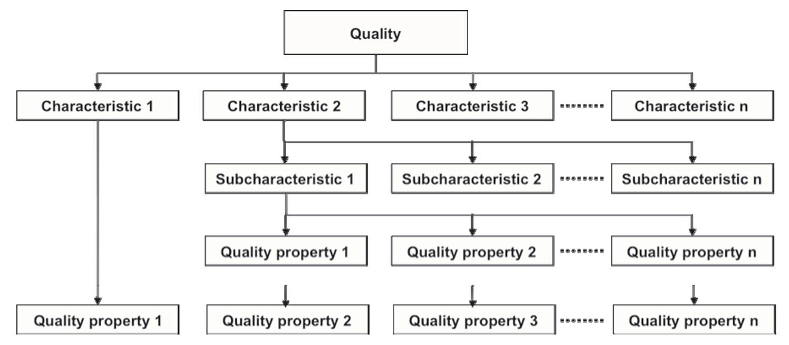
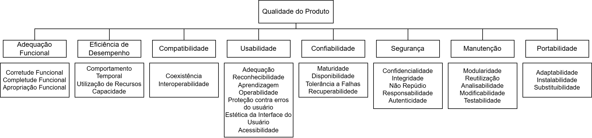

# 4. Especificação do modelo de qualidade

## Introdução

Os modelos de qualidade classificam a qualidade do produto de software em características e subcaracterísticas que, por sua vez, possuem propriedades mensuráveis. Essa estrutura, apresentada na **Figura 1** abaixo, permite avaliar melhor os atributos que compõem a qualidade de um sistema.

    
<strong>Figura 1 – Estrutura de um Modelo de Qualidade</strong>

    

    Fonte: ISO/IEC, 2011, p. 2.

No conjunto de normas da SQuaRE, existem três tipos de modelos de qualidade: o modelo de qualidade em uso e o modelo de qualidade do produto, definidos na ISO/IEC 25010, e o modelo de qualidade de dados definido na ISO/IEC 25012 (ISO/IEC, 2011, p. 2).

A equipe **Katherine Johnson** irá analisar o aplicativo **Guardiões da Saúde** usando o modelo de qualidade do produto. Portanto, o foco deste documento será no modelo de qualidade do produto.

## Modelo de Qualidade

O modelo de qualidade do produto é dividido em oito características: adequação funcional, eficiência de desempenho, compatibilidade, usabilidade, confiabilidade, segurança, manutenção e portabilidade.

A **Figura 2** abaixo apresenta o modelo de qualidade do produto, com suas características o subcaracterísticas.

    
<strong>Figura 2 – Modelo de Qualidade do Produto</strong>

    

    Fonte: Adaptado de ISO/IEC, 2011, p. 4.

A **Tabela 1** abaixo aprensenta a descrição de cada característica do modelo de qualidade do produto, de acordo com a ISO/IEC 25010:

    
<strong>Tabela 1 – Características de Qualidade</strong>

| Característica | Descrição |
| -------------- | --------- |
| **Adequação Funcional** |	Grau em que o produto fornece funções que atendem às necessidades declaradas e implícitas quando usado sob condições especificadas. |
| **Eficiência de Desempenho** | Desempenho relativo à quantidade de recursos usados sob condições estabelecidas. |
| **Compatibilidade** |	Grau em que um produto, sistema ou componente pode trocar informações com outros e/ou desempenhar suas funções enquanto compartilha o mesmo ambiente de hardware ou software. |
| **Usabilidade** |	Grau em que um produto pode ser usado por usuários especificados para atingir metas especificadas com eficácia, eficiência e satisfação. |
| **Confiabilidade** |Grau em que um sistema, produto ou componente desempenha funções especificadas sob condições especificadas por um período de tempo especificado. |
| **Segurança**	| Grau em que o produto protégé informações e dados para que pessoas, sistemas ou outros produtos tenham o grau de acesso apropriado a seus tipos e níveis de autorização. |
| **Manutenibilidade** | Grau de eficácia e eficiência com que um produto pode ser modificado pelos mantenedores. |
| **Portabilidade**	| Grau de eficácia e eficiência com que um sistema pode ser transferido de um ambiente de hardware, software ou outro ambiente operacional para outro. |

    Fonte: Tradução nossa de ISO/IEC 25010:2011, p. 10–16.

Considerando o modelo apresentado, a equipe decidiu analisar o produto de software com base nas seguintes características:  

- **Segurança**:  
  *Justificativa:* Essencial para proteger dados sensíveis dos usuários e garantir a integridade do sistema contra ameaças externas.

- **Confiabilidade**:  
  *Justificativa:* Fundamental para assegurar que o sistema funcione corretamente e esteja disponível quando necessário, evitando falhas que possam comprometer o serviço.

- **Manutenibilidade**:  
  *Justificativa:* Importante para facilitar atualizações, correções e adaptações futuras, garantindo a evolução contínua do software com baixo custo e esforço.

## Bibliografia

> INTERNATIONAL ORGANIZATION FOR STANDARDIZATION. ISO/IEC 25010:2011. Systems and software engineering — Systems and software Quality Requirements and Evaluation (SQuaRE) — System and software quality models. Genebra: ISO, 2011.

---

## Histórico de Versões

| Versão | Descrição | Autor(es) | Data de Produção | Revisor(es) | Data de Revisão | 
| :----: | --------- | --------- | :--------------: | ----------- | :-------------: |
| `1.0`  | Criação do documento | [Matheus Henrick](https://github.com/MatheusHenrickSantos) | 01/10/2025 |  |  |
