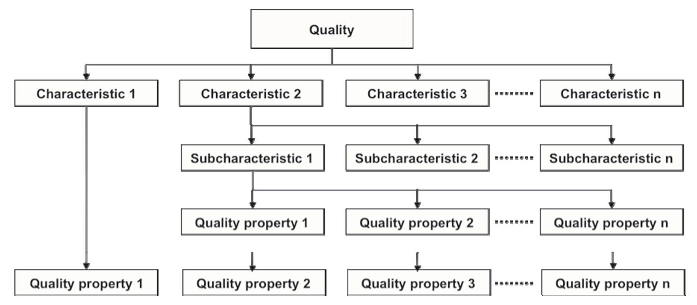
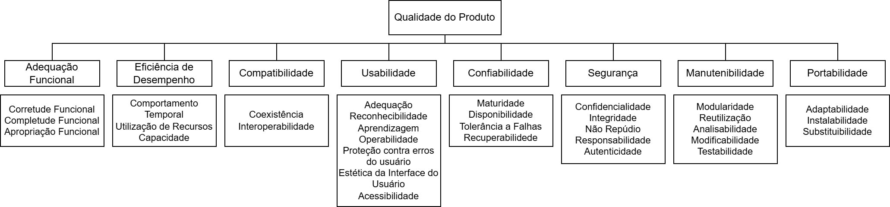

# 4. Especificação do modelo de qualidade

## 4.1 Introdução

Os modelos de qualidade classificam a qualidade do produto de software em características e subcaracterísticas que, por sua vez, possuem propriedades mensuráveis. Essa estrutura, apresentada na **Figura 1** abaixo, permite avaliar melhor os atributos que compõem a qualidade de um sistema.

    
<strong>Figura 1 – Estrutura de um Modelo de Qualidade</strong>

    

    Fonte: ISO/IEC, 2011, p. 2.

No conjunto de normas da SQuaRE, existem três tipos de modelos de qualidade: o modelo de qualidade em uso e o modelo de qualidade do produto, definidos na ISO/IEC 25010, e o modelo de qualidade de dados definido na ISO/IEC 25012 (ISO/IEC, 2011, p. 2).

A equipe **Katherine Johnson** irá analisar o aplicativo **Guardiões da Saúde** usando o modelo de qualidade do produto. Portanto, o foco deste documento será no modelo de qualidade do produto.

## 4.2 Modelo de Qualidade

O modelo de qualidade do produto é dividido em oito características: adequação funcional, eficiência de desempenho, compatibilidade, usabilidade, confiabilidade, segurança, manutenção e portabilidade.

A **Tabela 1** abaixo aprensenta a descrição de cada característica do modelo de qualidade do produto, de acordo com a ISO/IEC 25010:

    
<strong>Tabela 1 – Características de Qualidade</strong>

| Característica               | Descrição                                                                                                                                                                     |
| ---------------------------- | ----------------------------------------------------------------------------------------------------------------------------------------------------------------------------- |
|  **Adequação Funcional**      | Grau em que o produto fornece funções que atendem às necessidades declaradas e implícitas quando usado sob condições especificadas.                                           |
|  **Eficiência de Desempenho** | Desempenho relativo à quantidade de recursos usados sob condições estabelecidas.                                                                                              |
|  **Compatibilidade**          | Grau em que um produto, sistema ou componente pode trocar informações com outros e/ou desempenhar suas funções enquanto compartilha o mesmo ambiente de hardware ou software. |
|  **Usabilidade**              | Grau em que um produto pode ser usado por usuários especificados para atingir metas especificadas com eficácia, eficiência e satisfação.                                      |
|  **Confiabilidade**           | Grau em que um sistema, produto ou componente desempenha funções especificadas sob condições especificadas por um período de tempo especificado.                              |
|  **Segurança**               | Grau em que o produto protege informações e dados para que pessoas, sistemas ou outros produtos tenham o grau de acesso apropriado a seus tipos e níveis de autorização.      |
|  **Manutenibilidade**         | Grau de eficácia e eficiência com que um produto pode ser modificado pelos mantenedores.                                                                                      |
|  **Portabilidade**            | Grau de eficácia e eficiência com que um sistema pode ser transferido de um ambiente de hardware, software ou outro ambiente operacional para outro.                          |

    Fonte: Tradução nossa de ISO/IEC 25010:2011, p. 10–16.

A **Figura 2** abaixo apresenta o modelo de qualidade do produto, com suas características o subcaracterísticas.

    
<strong>Figura 2 – Modelo de Qualidade do Produto</strong>

    

    Fonte: Adaptado de ISO/IEC, 2011, p. 4.

## 4.3 Características de Qualidade

Considerando o modelo apresentado e as [necessidades das partes interessadas](partes-interessadas.md#22-mapeamento-das-partes-interessadas-stakeholders), a equipe decidiu analisar o produto de software com base nas seguintes características:

-   [**Segurança**](#seguranca):  
    _Justificativa:_ A escolha da característica Segurança como foco da avaliação de qualidade do sistema **Guardiões da Saúde** se justifica pela necessidade na proteção de dados sensíveis e na conformidade com a LGPD. A **ProEpi**, como desenvolvedora e mantenedora do sistema, precisa garantir a proteção dos dados dos usuários e a conformidade legal e os cidadãos, enquanto usuários finais, compartilham voluntariamente informações de saúde e esperam que seus dados pessoais sejam tratados com privacidade e segurança.

-   [**Confiabilidade**](#confiabilidade):  
    _Justificativa:_ A **ProEpi**, como desenvolvedora e mantenedora do sistema, precisa garantir que o aplicativo funcione de forma estável e sem falhas críticas. O **Ministério da Saúde** e as **Secretarias Estaduais e Municipais** precisam que os dados gerados pelo sistema estejam disponíveis para formular políticas públicas e responder a surtos epidemiológicos. E os cidadãos, enquanto usuários finais, devem ser capazes de reportar seu estado de saúde e receber informações úteis.

-   [**Manutenibilidade**](#manutenibilidade):  
    _Justificativa:_ A característica Manutenibilidade foi escolhida como foco da avaliação de qualidade, pois é importante para a **ProEpi** garantir a evolução, adaptação e manutenção contínua do sistema Guardiões da Saúde, acompanhando o surgimento de novas emergências sanitárias e projetos.

A escolha dessas três características (**Manutenibilidade**, **Segurança** e **Confiabilidade**) já estabelece um escopo robusto e abrangente para a avaliação e é onde está os maiores interesses dos clientes, de acordo com a análise feita em [**Requisitante e Partes Interessadas**](partes-interessadas.md#22-mapeamento-das-partes-interessadas-stakeholders). Adicionar a [**Adequação Funcional**](#adequacao), [**Eficiência de Desempenho**](#desempenho), [**Compatibilidade**](#compatibilidade), [**Usabilidade**](#usabilidade) e [**Portabilidade**](#portabilidade) resultaria em uma sobrecarga de esforço e tempo, comprometendo a profundidade da análise das características mais críticas para a evolução e a proteção do sistema.

---

## Referências Bibliográficas

> INTERNATIONAL ORGANIZATION FOR STANDARDIZATION. ISO/IEC 25010:2011. Systems and software engineering — Systems and software Quality Requirements and Evaluation (SQuaRE) — System and software quality models. Genebra: ISO, 2011.

---

## Histórico de Versões

| Versão | Descrição                      | Autor(es)                                                  | Data de Produção | Revisor(es) | Data de Revisão |
| :----: | ------------------------------ | ---------------------------------------------------------- | :--------------: | ----------- | :-------------: |
| `1.0`  | Criação do documento           | [Matheus Henrick](https://github.com/MatheusHenrickSantos) |    01/10/2025    |             |                 |
| `1.1`  | Linter e formatação            | [Gabriela Tiago](https://github.com/GabrielaTiago)         |    01/10/2025    |             |                 |
| `1.2`  | Conserta caminho da imagem     | [Gabriela Tiago](https://github.com/GabrielaTiago)         |    01/10/2025    |             |                 |
| `1.3`  | Atualiza numeração dos tópicos | [Gabriela Tiago](https://github.com/GabrielaTiago)         |    01/10/2025    |             |                 |
| `1.4` | Move a Tabela 1 para antes da Figura 2, melhora as justificativas para a escolha das características de qualidade, adiciona a justificativa para a não escolha das demais características e adiciona _links_ e âncoras | [Matheus Henrick](https://github.com/MatheusHenrickSantos) | 23/10/2025 |  |  |