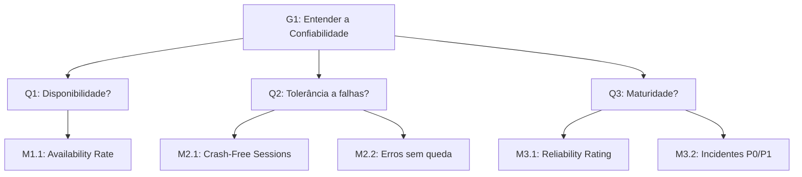

# 3. Confiabilidade

## 3.1 Introdução

A **confiabilidade** representa a capacidade de um software operar **de forma estável, precisa e contínua**, mesmo diante de condições adversas. Em sistemas como o **Guardiões da Saúde**, essa característica é importante para assegurar que os serviços funcionem corretamente.

Nesta etapa da análise, a confiabilidade é avaliada com base em aspectos como **disponibilidade, tolerância a falhas e maturidade**, buscando compreender em que medida o sistema mantém seu desempenho esperado ao longo do tempo.

---

## 3.2 Objetivo GQM

<table>
  <tr><th>Analisar</th><td>o Guardiões da Saúde</td></tr>
  <tr><th>Para o propósito de</th><td>Entender</td></tr>
  <tr><th>Com respeito a</th><td>confiabilidade</td></tr>
  <tr><th>Do ponto de vista da</th><td>equipe de desenvolvimento</td></tr>
  <tr><th>No contexto da</th><td>disciplina de Qualidade de Software</td></tr>
</table>

  
    Autor: <a href="https://github.com/MatheusHenrickSantos">Matheus Henrick</a>
  

---

## 3.3 Questões

As questões definidas para uma característica visam direcionar a avaliação e verificar se o objetivo de medição está sendo atingido. Foram definidas com base nas [subcaracterísticas](../fase-1/selecao-caracteristicas-avaliadas.md) selecionadas na Fase 1.**Disponibilidade / Tolerância a Falhas / Maturidade**

 

**Q1.** O sistema está disponível para uso na maior parte do tempo?

**Q2.** O sistema continua operando diante de falhas parciais sem queda total?

**Q3.** O sistema apresenta baixa incidência de bugs que impactem a operação?

---

## 3.4 Hipóteses

As hipóteses representam **expectativas sobre o comportamento ideal do software** em relação às [questões formuladas](#33-questões).  
Elas orientam a interpretação dos resultados das medições e permitem comparar o desempenho real do sistema com o esperado, fornecendo base para o julgamento qualitativo.

 

**H1:** A taxa de disponibilidade é ≥ 99% no período de observação.

**H2:** Eventos de falha não resultam em indisponibilidade total; o sistema mantém ≥ 95% de sessões sem crash (Crash-Free Sessions).

**H3:** O rating de confiabilidade (baseado em bugs) é A, com ≤ 5 bugs abertos relevantes.

---

## 3.5 Métricas

As métricas foram selecionadas com base nas questões e [hipóteses propostas](#34-hipóteses), seguindo o princípio do GQM de alinhar cada medida a um objetivo claro.

Essas métricas foram extraídas da ferramenta **SonarQube**, amplamente utilizada para avaliação automática de qualidade de código, e permitem quantificar fatores como **estabilidade, robustez e tolerância a falhas**.

**M1.1 (Q1):** Availability Rate (%) — proporção do tempo em que o sistema esteve funcional.

**M2.1 (Q2):** Erros sem queda (contagem) — falhas internas que não causam interrupção.

**M2.2 (Q2):** Erros com queda (contagem) — falhas que causam indisponibilidade total.

**M3.1 (Q3):** Reliability Rating (A–E) — classificação da estabilidade no SonarQube.

**M3.2 (Q3):** Bugs Count (por severidade) — contagem de erros críticos detectados.

---

## 3.6 Plano de Medição

O plano de medição detalha como cada métrica de confiabilidade será coletada, incluindo as ferramentas utilizadas, a frequência de coleta e os responsáveis pela execução, garantindo consistência e objetividade no processo.

|  ID  | Métrica                     | Descrição                                                                                                                                 | Tipo     | Escala   | Fonte de Coleta                                           | Ferramenta                                                                     | Procedimento de Coleta                                                                                                                                                                       |
| :--: | --------------------------- | ----------------------------------------------------------------------------------------------------------------------------------------- | -------- | -------- | --------------------------------------------------------- | ------------------------------------------------------------------------------ | -------------------------------------------------------------------------------------------------------------------------------------------------------------------------------------------- |
| M1.1 | Availability Rate (%)       | Proporção do tempo em que o sistema esteve funcional e acessível aos usuários.                                                            | Direta   | De Razão | Ferramentas de monitoramento de serviços/servidores.      | Ferramentas de Uptime Monitoring (ex: UptimeRobot) e Planilha de consolidação. | Configurar um serviço de monitoramento para verificar a disponibilidade do endpoint principal a cada 5 minutos. Consolidar os dados de uptime e downtime para calcular a porcentagem mensal. |
| M2.1 | Erros sem queda (contagem)  | Contagem de erros não fatais (exceções tratadas) registrados nos logs do sistema que não resultaram em interrupção do serviço.            | Direta   | Absoluta | Logs da aplicação.                                        | Sistema de monitoramento de logs (ex: Sentry, Datadog).                        | Analisar os logs da aplicação para quantificar o número de eventos de erro registrados que não foram classificados como "crash" ou "fatal".                                                  |
| M2.2 | Erros com queda (contagem)  | Contagem absoluta de eventos de crash (encerramento inesperado do aplicativo ou queda do servidor) que levaram à indisponibilidade.       | Direta   | Absoluta | Plataformas de análise de aplicativos e logs de servidor. | Firebase Crashlytics (para o app) ou logs do servidor.                         | A ferramenta de crash reporting agrupa os crashes automaticamente. A análise consiste em extrair o número de eventos para os principais tipos de crash reportados.                           |
| M3.1 | Reliability Rating (A–E)    | Classificação de A a E fornecida pelo SonarQube baseada no número e na severidade dos bugs encontrados no código-fonte.                   | Indireta | Ordinal  | Código-fonte                                              | SonarQube                                                                      | Executar a análise estática do SonarQube no código-fonte. A ferramenta calcula e exibe o "Reliability Rating" automaticamente no dashboard do projeto.                                       |
| M3.2 | Bugs Count (por severidade) | Contagem de problemas de código identificados pelo SonarQube como "Bugs", classificados por severidade (Blocker, Critical, Major, Minor). | Direta   | Absoluta | Código-fonte.                                             | SonarQube                                                                      | Executar a análise estática do SonarQube. Extrair do dashboard o número de bugs para cada nível de severidade.                                                                               |

  
    Autores:  <a href="https://github.com/uires2023">Uires Carlos de Oliveira</a> e <a href="https://github.com/GabrielaTiago">Gabriela Tiago</a>
  

---

## 3.7 Níveis de Pontuação e Critérios de Julgamento

Os **níveis de pontuação** foram definidos para possibilitar uma **interpretação padronizada dos resultados** das [medições](#35-métricas).
Cada métrica é associada a uma escala de valores que varia de _insuficiente_ a _excelente_, permitindo avaliar o grau de atendimento das boas práticas de qualidade de software.

| ID   | Métrica                     | Nível de Pontuação                                                                                                                                                 | Critérios de Julgamento                                                                                                                                                                                                                    |
| ---- | --------------------------- | ------------------------------------------------------------------------------------------------------------------------------------------------------------------ | ------------------------------------------------------------------------------------------------------------------------------------------------------------------------------------------------------------------------------------------ |
| M1.1 | Availability Rate (%)       | **Excelente:** ≥ 99% **Bom:** 97% - 98.9% **Satisfatório:** 95% - 96.9% **Insuficiente:** < 95%                                                                    | Uma taxa de disponibilidade "Insuficiente" indica que o sistema está frequentemente indisponível (Q1), o que compromete sua utilidade para a vigilância em saúde e a confiança dos usuários. O alvo é ≥ 99%, conforme a hipótese H1.       |
| M2.1 | Erros sem queda (contagem)  | **Excelente:** 0-10 **Bom:** 11-25 **Satisfatório:** 26-50 **Insuficiente:** > 50                                                                                  | Embora não causem a queda do sistema, um número elevado de erros internos indica instabilidade e degrada a experiência do usuário, sendo um indicador negativo para a tolerância a falhas (Q2).                                            |
| M2.2 | Erros com queda (contagem)  | **Excelente:** 0 **Bom:** 1-2 **Satisfatório:** 3-5 **Insuficiente:** > 5                                                                                          | Erros que causam a queda do sistema são a falha mais crítica de confiabilidade. Um número "Insuficiente" representa uma falha grave na tolerância a falhas (Q2) e na disponibilidade do serviço.                                           |
| M3.1 | Reliability Rating (A–E)    | **Excelente:** A **Bom:** B **Satisfatório:** C **Insuficiente:** D ou E                                                                                           | Esta métrica do SonarQube resume a maturidade do código (Q3). Uma classificação "Insuficiente" (D ou E) indica uma alta probabilidade de comportamento inesperado em produção devido a bugs no código. O alvo é A, conforme a hipótese H3. |
| M3.2 | Bugs Count (por severidade) | **Excelente:** 0 Blocker / 0 Critical **Bom:** 0 Blocker / ≤ 5 Critical **Satisfatório:** 1 Blocker / ≤ 10 Critical **Insuficiente:** > 1 Blocker ou > 10 Critical | A presença de bugs "Blocker" ou "Critical" no código-fonte tem uma alta probabilidade de se manifestar como falhas operacionais, impactando diretamente a maturidade e a confiabilidade do sistema (Q3).                                   |

  
    Autores:  <a href="https://github.com/uires2023">Uires Carlos de Oliveira</a> e <a href="https://github.com/GabrielaTiago">Gabriela Tiago</a>
  

---

## 3.8 Tabela GQM

A tabela GQM consolida as relações entre **objetivos, questões, métricas, fontes de dados e periodicidade de coleta**.  
Essa visão integrada facilita o acompanhamento das medições e a verificação contínua da qualidade, garantindo que as decisões sejam tomadas com base em evidências quantitativas e consistentes.

| Objetivo                                         | Questão                                                                    | Métrica                        | Fonte         | Periodicidade | Alvo                       |
| ------------------------------------------------ | -------------------------------------------------------------------------- | ------------------------------ | ------------- | ------------- | -------------------------- |
| Entender a confiabilidade do Guardiões da Saúde. | Q1. O sistema está disponível para uso na maior parte do tempo?            | Availability Rate (%)          | Monitoramento | Mensal        | ≥ 99%                      |
|                                                  | Q2. O sistema continua operando diante de falhas parciais sem queda total? | Erros sem queda / com queda    | Logs          | Mensal        | ≥ 95% de sessões sem queda |
|                                                  | Q3. O sistema apresenta baixa incidência de bugs que impactem a operação?  | Reliability Rating; Bugs Count | SonarQube     | Mensal        | Rating A + ≤ 5 bugs        |

  
    Autores:  <a href="https://github.com/uires2023">Uires Carlos de Oliveira</a> e <a href="https://github.com/trindadea">Arthur Trindade</a>
  

---

## 3.9 Diagrama GQM

  
    Autores:  <a href="https://github.com/uires2023">Uires Carlos de Oliveira</a> e <a href="https://github.com/GabrielaTiago">Gabriela Tiago</a>
  

---

## 3.10 Referências

> BASILI, Victor R.; CALDIERA, Gianluigi; ROMBACH, Hans Dieter. _The Goal Question Metric (GQM) Approach._ In: MARCINIAK, J. J. (ed.). _Encyclopedia of Software Engineering._ New York: John Wiley & Sons, 1994. cap. 6, p. 51–55.  
> INTERNATIONAL ORGANIZATION FOR STANDARDIZATION. _ISO/IEC 25023:2011._ Systems and software engineering — Systems and software Quality Requirements and Evaluation (SQuaRE) — System and software quality models. Genebra: ISO, 2011.

---

## 3.11 Histórico de Versões

| Versão | Data       | Descrição                                                                   | Autor(es)                                                                                                            |
| ------ | ---------- | --------------------------------------------------------------------------- | -------------------------------------------------------------------------------------------------------------------- |
| `1.0`  | 14/10/2025 | Criação do documento                                                        | [Uires Carlos de Oliveira](https://github.com/uires2023), [Matheus Henrick](https://github.com/MatheusHenrickSantos) |
| `1.1`  | 15/10/2025 | Formatação do texto, remoção de informações redundantes                     | [Gabriela Tiago](https://github.com/GabrielaTiago)                                                                   |
| `1.2`  | 24/10/2025 | Reestruturação do artefato, adição da introdução e dos links de navegação   | [Arthur Carneiro](https://github.com/trindadea)                                                                      |
| `1.3`  | 25/10/2025 | Ajuste dos itens 2.2 - 3.2 - 4.2 (propósitos somente o verbo no infinitivo) | [Uires Carlos de Oliveira](https://github.com/uires2023)                                                             |
| `1.4`  | 25/10/2025 | Revisão Confiabilidade                                                      | [Uires Carlos de Oliveira](https://github.com/uires2023)                                                             |
| `1.5`  | 25/10/2025 | Ajustes na formatação, refatoração de textos e correção do diagrama GQM     | [Gabriela Tiago](https://github.com/GabrielaTiago)                                                                   |
