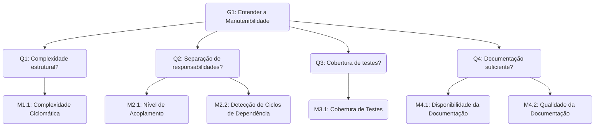

# 2. Manutenibilidade

## 2.1 Introdução

A **manutenibilidade** é uma característica fundamental para garantir a evolução contínua e a longevidade de um software. Ela reflete a facilidade com que o sistema pode ser **compreendido, modificado, corrigido e evoluído** ao longo do tempo.

Para o Guardiões da Saúde — uma plataforma usada em monitoramento participativo de sintomas — assegurar uma boa manutenibilidade é crucial para evolução contínua do código e rápida resposta às demandas de saúde pública.

Nesta fase, a manutenibilidade será avaliada com base em três subcaracterísticas priorizadas na Fase 1: **analisabilidade**, **modificabilidade** e **testabilidade**.

A análise de manutenibilidade busca identificar aspectos estruturais e técnicos que influenciam a facilidade de manutenção, como **modularidade, complexidade, duplicação de código, documentação e cobertura de testes**

## 2.2 Objetivo GQM

<table>
  <tr><th>Analisar</th><td>o Guardiões da Saúde</td></tr>
  <tr><th>Para o propósito de</th><td>Entender</td></tr>
  <tr><th>Com respeito a</th><td>manutenibilidade</td></tr>
  <tr><th>Do ponto de vista da</th><td>equipe de desenvolvimento</td></tr>
  <tr><th>No contexto da</th><td>disciplina de Qualidade de Software</td></tr>
</table>

  
    Autor: <a href="https://github.com/MatheusHenrickSantos">Matheus Henrick</a>
  

---

## 2.3 Questões

As questões definidas para uma característica visam direcionar a avaliação e verificar se o objetivo de medição está sendo atingido.

As questões avaliativas foram definidas com base nas subcaracterísticas selecionadas na Fase 1.

**Analisabilidade/ Testabilidade**
 

**Q1**. Qual o nível de complexidade estrutural do código-fonte do sistema?

**Q2**. As responsabilidades dos módulos estão bem separadas?

**Q3**. O código está suficientemente coberto por testes automatizados?

**Q4**. A documentação técnica existente é suficiente para apoiar futuras manutenções?

---

## 2.4 Hipóteses

As hipóteses representam **expectativas sobre o comportamento ideal do software** em relação às [questões formuladas](#23-questões).
Elas orientam a interpretação dos resultados das medições e permitem comparar o desempenho real do sistema com o esperado, fornecendo base para o julgamento qualitativo.

 

**H1:** O grau de acoplamento entre os módulos é baixo, com poucas dependências diretas, permitindo modificações locais sem impacto significativo.

**H2:** Não há ciclos de dependência entre pacotes ou módulos, garantindo arquitetura modular e reusável.

**H3:** O código possui cobertura de testes automatizados de pelo menos 70%.

**H4:** Espera-se que a documentação de arquitetura geral exista, mas que a documentação detalhada de componentes seja limitada ou desatualizada.

---

## 2.5 Métricas

As métricas foram selecionadas com base nas [questões](#23-questões) e [hipóteses propostas](#24-hipóteses), seguindo o princípio do GQM de alinhar cada medida a um objetivo claro.

 

**M1.1 (Q1):** Complexidade Ciclomática: Mede a complexidade de um programa contando o número de caminhos linearmente independentes através do código-fonte. Um número alto indica um código mais complexo e difícil de testar e manter.

**M2.1 (Q2):** Nível de Acoplamento entre Módulos: Mede o grau de interdependência entre os módulos do software. Um acoplamento alto significa que uma mudança em um módulo tem grande probabilidade de impactar outros, dificultando a manutenção.

**M2.2 (Q2):** Detecção de Ciclos de Dependência: Verifica a existência de dependências circulares entre módulos ou pacotes (ex: Módulo A depende de B, que depende de C, que depende de A). Ciclos de dependência violam o princípio do design modular e dificultam a reutilização e o teste.

**M3.1 (Q3):** Cobertura de Testes Automatizados (%): Mede a porcentagem do código-fonte que é executada por uma suíte de testes automatizados. Uma cobertura alta indica maior testabilidade e menor risco de regressões.

**M4.1 (Q4):** Disponibilidade da Documentação: Verifica a existência (Sim/Não) de artefatos de documentação considerados essenciais, como o documento de arquitetura e os manuais de API.

**M4.2 (Q4):** Qualidade da Documentação: Avalia a documentação existente com base em critérios como clareza, completude e atualização, usando uma escala predefinida.

---

## 2.6 Plano de Medição

O plano de medição detalha como cada métrica será coletada, incluindo as ferramentas utilizadas, a frequência de coleta e os responsáveis pela execução.

|  ID  | Métrica                           | Descrição                                                                                      | Tipo     | Escala   | Fonte de Coleta       | Ferramenta               | Procedimento de Coleta                                                                                                                 |
| :--: | --------------------------------- | ---------------------------------------------------------------------------------------------- | -------- | -------- | --------------------- | ------------------------ | -------------------------------------------------------------------------------------------------------------------------------------- |
| M1.1 | Complexidade Ciclomática          | Contagem do número de caminhos independentes em um módulo.                                     | Indireta | De Razão | Código-fonte          | SonarQube                | Executar a análise estática do SonarQube no código-fonte. A ferramenta calcula automaticamente a complexidade para cada método.        |
| M2.1 | Nível de Acoplamento              | Medida do grau de interdependência entre módulos (ex: número de chamadas externas).            | Indireta | De Razão | Código-fonte          | SonarQube                | Analisar os relatórios de dependência gerados pelo SonarQube para identificar o número de classes/módulos dos quais um módulo depende. |
| M2.2 | Detecção de Ciclos de Dependência | Verificação da existência de dependências circulares entre módulos.                            | Direta   | Nominal  | Código-fonte          | SonarQube / Brakeman     | Executar a análise estática da ferramenta, que reportará a existência (Sim) ou ausência (Não) de ciclos de dependência.                |
| M3.1 | Cobertura de Testes (%)           | Percentual do código-fonte executado por testes automatizados.                                 | Indireta | De Razão | Repositório de código | Ferramentas de cobertura | Analisar os relatórios de cobertura gerados automaticamente durante a execução da suíte de testes no ambiente de integração contínua.  |
| M4.1 | Disponibilidade da Documentação   | Verificação da existência de documentos-chave (arquitetura, API).                              | Direta   | Nominal  | Repositório           | Manual                   | Inspeção do repositório para verificar a presença (Sim) ou ausência (Não) dos artefatos de documentação definidos como essenciais.     |
| M4.2 | Qualidade da Documentação         | Avaliação da documentação com base em clareza, completude e atualização (1=Ruim, 5=Excelente). | Direta   | Ordinal  | Documentação          | Manual (Checklist)       | Um membro da equipe utilizará um checklist para avaliar cada documento e atribuir uma nota de 1 a 5.                                   |

  
    Autora: <a href="https://github.com/GabrielaTiago">Gabriela Tiago</a>
  

## 2.7 Níveis de Pontuação e Critérios de Julgamento

Os **níveis de pontuação** foram definidos para possibilitar uma **interpretação padronizada dos resultados** das [medições](#25-métricas).
Cada métrica é associada a uma escala de valores que varia de _insuficiente_ a _excelente_, permitindo avaliar o grau de atendimento das boas práticas de qualidade de software.

|  ID  | Métrica                           | Nível de Pontuação                                                                                                      | Critérios de Julgamento                                                                                            |
| :--: | --------------------------------- | ----------------------------------------------------------------------------------------------------------------------- | ------------------------------------------------------------------------------------------------------------------ |
| M1.1 | Complexidade Ciclomática          | **< 10:** Baixa complexidade (Aceitável) **11-20:** Complexidade moderada (Atenção) **20:** Alta complexidade (Crítico) | Módulos com complexidade "Crítica" são fortes candidatos a refatoração e indicam baixa manutenibilidade.           |
| M2.2 | Detecção de Ciclos de Dependência | **Não:** Aceitável **Sim:** Crítico                                                                                     | A existência de ciclos de dependência é uma falha arquitetural grave que impacta negativamente a manutenibilidade. |
| M3.1 | Cobertura de Testes (%)           | **> 70%:** Adequada **50-70%:** A melhorar **< 50%:** Insuficiente                                                      | Uma cobertura "Insuficiente" indica alto risco de regressão e baixa testabilidade.                                 |
| M4.2 | Qualidade da Documentação         | **4-5:** Boa **3:** Regular **1-2:** Ruim"                                                                              | Uma avaliação "Ruim" indica que a documentação não é confiável para guiar novas manutenções.                       |

  
    Autores:  <a href="https://github.com/trindadea">Arthur Trindade</a> e <a href="https://github.com/GabrielaTiago">Gabriela Tiago</a>
  

---

## 2.8 Tabela GQM

A tabela GQM consolida as relações entre **objetivos, questões, métricas, fontes de dados e periodicidade de coleta**.  
Essa visão integrada facilita o acompanhamento das medições e a verificação contínua da qualidade, garantindo que as decisões sejam tomadas com base em evidências quantitativas e consistentes.

| Objetivo                                                                        | Questão                                                                            | Métrica                           | Fonte                    | Periodicidade | Alvo       |
| ------------------------------------------------------------------------------- | ---------------------------------------------------------------------------------- | --------------------------------- | ------------------------ | ------------- | ---------- |
| Entender a facilidade de manutenção e evolução do código do Guardiões da Saúde. | Q1. Qual o nível de complexidade estrutural do código-fonte do sistema?            | Complexidade Ciclomática          | SonarQube                | Uma vez       | Média < 10 |
|                                                                                 | Q2. As responsabilidades dos módulos estão bem separadas?                          | Nível de Acoplamento              | SonarQube                | Uma vez       | Baixo      |
|                                                                                 |                                                                                    | Detecção de Ciclos de Dependência | SonarQube                | Uma vez       | Não        |
|                                                                                 | Q3. O código está suficientemente coberto por testes automatizados?                | Cobertura de Testes (%)           | Ferramentas de Cobertura | Uma vez       | > 70%      |
|                                                                                 | Q4. A documentação técnica existente é suficiente para apoiar futuras manutenções? | Disponibilidade da Documentação   | Manual                   | Uma vez       | Sim        |
|                                                                                 |                                                                                    | Qualidade da Documentação         | Manual (Checklist)       | Uma vez       | 4-5 (Boa)  |

  
    Autores:  <a href="https://github.com/trindadea">Arthur Trindade</a> e <a href="https://github.com/GabrielaTiago">Gabriela Tiago</a>
  

---

## 2.9 Diagrama GQM

  
    Autora: <a href="https://github.com/GabrielaTiago">Gabriela Tiago</a>
  

---

## 2.10 Referências Bibliográficas

> BASILI, Victor R.; CALDIERA, Gianluigi; ROMBACH, Hans Dieter. _The Goal Question Metric (GQM) Approach._ In: MARCINIAK, J. J. (ed.). _Encyclopedia of Software Engineering._ New York: John Wiley & Sons, 1994. cap. 6, p. 51–55.
> INTERNATIONAL ORGANIZATION FOR STANDARDIZATION. _ISO/IEC 25023:2011._ Systems and software engineering — Systems and software Quality Requirements and Evaluation (SQuaRE) — System and software quality models. Genebra: ISO, 2011.

---

## 2.10 Histórico de Versões

| Versão | Data       | Descrição                                                                                              | Autor(es)                                                                                                            |
| ------ | ---------- | ------------------------------------------------------------------------------------------------------ | -------------------------------------------------------------------------------------------------------------------- |
| `1.0`  | 14/10/2025 | Criação do documento                                                                                   | [Uires Carlos de Oliveira](https://github.com/uires2023), [Matheus Henrick](https://github.com/MatheusHenrickSantos) |
| `1.1`  | 15/10/2025 | Formatação do texto, remoção de informações redundantes                                                | [Gabriela Tiago](https://github.com/GabrielaTiago)                                                                   |
| `1.2`  | 24/10/2025 | Reestruturação do artefato, adição da introdução e dos links de navegação                              | [Arthur Carneiro](https://github.com/trindadea)                                                                      |
| `1.3`  | 25/10/2025 | Ajuste dos itens 2.2 - 3.2 - 4.2 (propósitos somente o verbo no infinitivo)                            | [Uires Carlos de Oliveira](https://github.com/uires2023)                                                             |
| `1.4`  | 25/10/2025 | Revisão e atualização da seção de Manutenibilidade, incluindo ajustes nas métricas, tabelas e diagrama | [Gabriela Tiago](https://github.com/GabrielaTiago)                                                                   |
