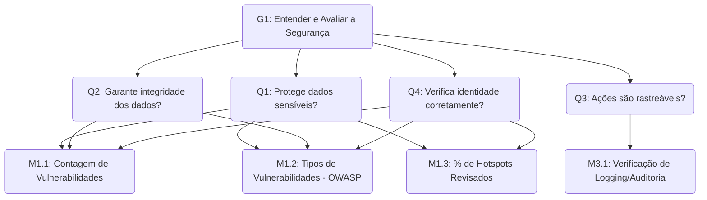

# 4. Segurança

## 4.1 Introdução

A **segurança de software** é uma característica de qualidade essencial, especialmente em sistemas que tratam **informações sensíveis e dados pessoais dos usuários**, como o **Guardiões da Saúde**. A proteção desses dados é uma prioridade para todos os stakeholders, desde os cidadãos que fornecem as informações até os gestores de saúde que as utilizam, e é um requisito legal sob a Lei Geral de Proteção de Dados (LGPD).

Esta análise de segurança foca na identificação de vulnerabilidades no código-fonte e em suas dependências, que poderiam comprometer a **confidencialidade**, **integridade** e **disponibilidade** dos dados, garantindo que o sistema esteja protegido contra acessos e modificações não autorizadas.

---

## 4.2 Objetivo GQM

<table>
  <tr><th>Analisar</th><td>o Guardiões da Saúde</td></tr>
  <tr><th>Para o propósito de</th><td>Entender e Avaliar</td></tr>
  <tr><th>Com respeito a</th><td>segurança</td></tr>
  <tr><th>Do ponto de vista da</th><td>equipe de desenvolvimento</td></tr>
  <tr><th>No contexto da</th><td>disciplina de Qualidade de Software</td></tr>
</table>

  
    Autor: <a href="https://github.com/MatheusHenrickSantos">Matheus Henrick</a>
  

---

## 4.3 Questões

As questões definidas para uma característica visam direcionar a avaliação e verificar se o objetivo de medição está sendo atingido.

 

**Q1.** O sistema protege adequadamente os dados sensíveis dos usuários?

**Q2.** O sistema garante que os dados não sejam alterados indevidamente?

**Q3.** As ações dos usuários e do sistema são rastreáveis e auditáveis?

**Q4.** O sistema verifica corretamente a identidade dos usuários?

---

## 4.4 Hipóteses

As hipóteses representam **expectativas sobre o estado de segurança do software** em relação às [questões formuladas](#43-questões).
Elas orientam a interpretação dos resultados das medições e permitem comparar o desempenho real do sistema com o esperado, fornecendo base para o julgamento qualitativo.

 

**H1:** Os dados sensíveis estão protegidos por mecanismos de criptografia e controle de acesso.

**H2:** Os dados são protegidos contra alterações não autorizadas, com validações e registros de auditoria.

**H3:** O sistema registra ações relevantes com identificação clara do autor e timestamp, permitindo auditoria.

**H4:** O sistema utiliza mecanismos seguros de autenticação, evitando acessos indevidos.

---

## 4.5 Métricas

As métricas foram selecionadas com base nas questões e [hipóteses propostas](#44-hipóteses), seguindo o princípio do GQM de alinhar cada medida a um objetivo claro.

Um conjunto de métricas quantitativas e qualitativas foi definido para avaliar a segurança do sistema, focando na **identificação de vulnerabilidades, revisão de pontos críticos de segurança e conformidade com boas práticas reconhecidas**.

 

**M1.1 (Q1, Q2, Q4):** Contagem de Vulnerabilidades por Severidade: Mede o número de fraquezas de segurança encontradas no código-fonte, classificadas por severidade (Crítica, Alta, Média, Baixa). Vulnerabilidades podem comprometer a proteção de dados (Q1), permitir alterações indevidas (Q2) e quebrar mecanismos de autenticação (Q4).

**M1.2 (Q1, Q2, Q4):** Tipos de Vulnerabilidades (Mapeamento OWASP Top 10): Classifica as vulnerabilidades encontradas de acordo com as categorias de risco mais críticas para aplicações web, como Broken Access Control (A01), Cryptographic Failures (A02), Injection (A03) e Broken Authentication (A07). Isso permite uma análise qualitativa dos riscos relacionados à proteção de dados (Q1), integridade (Q2) e autenticação (Q4).

**M1.3 (Q1, Q2, Q4):** Percentual de Security Hotspots Revisados: Mede a proporção de pontos de código que são sensíveis à segurança (ex: manipulação de senhas, queries a banco de dados) e que já foram revisados por um desenvolvedor. Um baixo percentual de revisão indica riscos potenciais não avaliados.

**M3.1 (Q3):** Verificação da Implementação de Mecanismos de Log/Auditoria: Avalia a existência (Sim/Não) de um framework de logging consistente no código, capaz de registrar ações relevantes para auditoria. Esta é uma métrica qualitativa, verificada manualmente.

---

## 4.6 Plano de Medição

O plano de medição detalha como cada métrica de segurança será coletada, incluindo as ferramentas utilizadas, a frequência de coleta e os responsáveis pela execução, garantindo consistência e objetividade no processo.

|  ID  | Métrica                                                     | Descrição                                                                                                                                         | Tipo     | Escala   | Fonte de Coleta | Ferramenta        | Procedimento de Coleta                                                                                                                                                     |
| :--: | ----------------------------------------------------------- | ------------------------------------------------------------------------------------------------------------------------------------------------- | -------- | -------- | --------------- | ----------------- | -------------------------------------------------------------------------------------------------------------------------------------------------------------------------- |
| M1.1 | Contagem de Vulnerabilidades por Severidade                 | Contagem de fraquezas de segurança encontradas no código-fonte, agrupadas por severidade para priorizar correções.                                | Direta   | Absoluta | Código-fonte    | SonarQube (SAST)  | Executar a análise de segurança estática (SAST). A ferramenta classifica automaticamente as vulnerabilidades encontradas.                                                  |
| M1.2 | Tipos de Vulnerabilidades (Mapeamento OWASP Top 10)         | Classificação das vulnerabilidades encontradas de acordo com as categorias de risco do OWASP Top 10 para entender a natureza das falhas.          | Direta   | Nominal  | Código-fonte    | SonarQube (SAST)  | Mapear os resultados da análise SAST para as categorias correspondentes do OWASP Top 10, utilizando os relatórios da ferramenta.                                           |
| M1.3 | Percentual de Security Hotspots Revisados                   | Proporção de pontos de código sensíveis à segurança que foram revisados por um desenvolvedor para garantir que riscos potenciais foram avaliados. | Indireta | De Razão | Código-fonte    | SonarQube (SAST)  | Extrair do dashboard do SonarQube o número de hotspots marcados como "Revisado" e o número total de hotspots para calcular o percentual.                                   |
| M3.1 | Verificação da Implementação de Mecanismos de Log/Auditoria | Verificação da existência de um framework de logging implementado nas principais rotinas de negócio para garantir a rastreabilidade.              | Direta   | Nominal  | Código-fonte    | Manual (Inspeção) | Inspecionar o código-fonte de módulos críticos (ex: autenticação, manipulação de dados) para verificar a presença (Sim) ou ausência (Não) de chamadas a um sistema de log. |

  
    Autora: <a href="https://github.com/GabrielaTiago">Gabriela Tiago</a>
  

---

## 4.7 Níveis de Pontuação e Critérios de Julgamento

Os **níveis de pontuação** foram definidos para possibilitar uma **interpretação padronizada dos resultados** das [medições](#45-métricas).  
Cada métrica é associada a uma escala de valores que varia de _insuficiente_ a _excelente_, permitindo avaliar o grau de atendimento das boas práticas de qualidade de software.

|  ID  | Métrica                                                     | Nível de Pontuação                                                                                                                                | Critérios de Julgamento                                                                                                                                                                                                                     |
| :--: | ----------------------------------------------------------- | ------------------------------------------------------------------------------------------------------------------------------------------------- | ------------------------------------------------------------------------------------------------------------------------------------------------------------------------------------------------------------------------------------------- |
| M1.1 | Contagem de Vulnerabilidades por Severidade                 | **Excelente:** 0 Críticas / 0 Altas **Bom:** 0 Críticas / ≤ 5 Altas **Insuficiente:** > 5 Altas ou qualquer Crítica                               | A presença de vulnerabilidades "Críticas" ou "Altas" indica um risco de segurança imediato que precisa ser corrigido, pois pode comprometer diretamente a proteção dos dados (Q1), sua integridade (Q2) e a autenticação dos usuários (Q4). |
| M1.2 | Tipos de Vulnerabilidades (Mapeamento OWASP Top 10)         | **Excelente:** Ausência de vulnerabilidades nas categorias A01, A02, A03, A07 **Atenção:** Presença de qualquer vulnerabilidade nessas categorias | A presença de vulnerabilidades como Broken Access Control (A01), Cryptographic Failures (A02), Injection (A03) ou Broken Authentication (A07) representa uma falha grave e um risco direto à segurança dos dados e do sistema.              |
| M1.3 | Percentual de Security Hotspots Revisados                   | **Excelente:** 100% **Bom:** 80-99% **Insuficiente:** < 80%                                                                                       | Um percentual "Insuficiente" indica que existem riscos de segurança potenciais no código que não foram devidamente analisados pela equipe, deixando brechas que podem ser exploradas.                                                       |
| M3.1 | Verificação da Implementação de Mecanismos de Log/Auditoria | **Aceitável:** Sim **Insuficiente:** Não                                                                                                          | A ausência ("Não") de um mecanismo de logging impede a rastreabilidade e auditoria das ações (Q3), falhando em atender a um requisito básico de segurança e conformidade para sistemas que manipulam dados sensíveis.                       |

  
    Autores:  <a href="https://github.com/trindadea">Arthur Trindade</a> e <a href="https://github.com/GabrielaTiago">Gabriela Tiago</a>
  

---

## 4.8 Tabela GQM

A tabela GQM consolida as relações entre **objetivos, questões, métricas, fontes de dados e periodicidade de coleta**.  
Essa visão integrada facilita o acompanhamento das medições e a verificação contínua da qualidade, garantindo que as decisões sexjam tomadas com base em evidências quantitativas e consistentes.

| Objetivo                                                        | Questão                                                               | Métrica                                                     | Fonte             | Periodicidade | Alvo                                     |
| --------------------------------------------------------------- | --------------------------------------------------------------------- | ----------------------------------------------------------- | ----------------- | ------------- | ---------------------------------------- |
| Entender e avaliar a segurança do código do Guardiões da Saúde. | Q1. O sistema protege adequadamente os dados sensíveis dos usuários?  | Contagem de Vulnerabilidades por Severidade                 | SonarQube         | Uma vez       | 0 Críticas / 0 Altas                     |
|                                                                 |                                                                       | Tipos de Vulnerabilidades (OWASP)                           | SonarQube         | Uma vez       | Ausência de Cryptographic Failures (A02) |
|                                                                 | Q2. O sistema garante que os dados não sejam alterados indevidamente? | Tipos de Vulnerabilidades (OWASP)                           | SonarQube         | Uma vez       | Ausência de Injection (A03)              |
|                                                                 | Q3. As ações dos usuários e do sistema são rastreáveis e auditáveis?  | Verificação da Implementação de Mecanismos de Log/Auditoria | Manual (Inspeção) | Uma vez       | Sim                                      |
|                                                                 | Q4. O sistema verifica corretamente a identidade dos usuários?        | Percentual de Security Hotspots Revisados                   | SonarQube         | Uma vez       | 100%                                     |
|                                                                 |                                                                       | Tipos de Vulnerabilidades (OWASP)                           | SonarQube         | Uma vez       | Ausência de Broken Authentication (A07)  |

  
    Autores:  <a href="https://github.com/trindadea">Arthur Trindade</a> e <a href="https://github.com/GabrielaTiago">Gabriela Tiago</a>
  

---

## 4.8 Diagrama GQM

  
    Autora: <a href="https://github.com/GabrielaTiago">Gabriela Tiago</a>
  

---

## 4.9 Referências Bibliográficas

> BASILI, Victor R.; CALDIERA, Gianluigi; ROMBACH, Hans Dieter. _The Goal Question Metric (GQM) Approach._ In: MARCINIAK, J. J. (ed.). _Encyclopedia of Software Engineering._ New York: John Wiley & Sons, 1994. cap. 6, p. 51–55.  
> INTERNATIONAL ORGANIZATION FOR STANDARDIZATION. _ISO/IEC 25023:2011._ Systems and software engineering — Systems and software Quality Requirements and Evaluation (SQuaRE) — System and software quality models. Genebra: ISO, 2011.

---

## 4.10 Histórico de Versões

| Versão | Data       | Descrição                                                                                       | Autor(es)                                                                                                            |
| ------ | ---------- | ----------------------------------------------------------------------------------------------- | -------------------------------------------------------------------------------------------------------------------- |
| `1.0`  | 14/10/2025 | Criação do documento                                                                            | [Uires Carlos de Oliveira](https://github.com/uires2023), [Matheus Henrick](https://github.com/MatheusHenrickSantos) |
| `1.1`  | 15/10/2025 | Formatação do texto, remoção de informações redundantes                                         | [Gabriela Tiago](https://github.com/GabrielaTiago)                                                                   |
| `1.2`  | 24/10/2025 | Reestruturação do artefato, adição da introdução e dos links de navegação                       | [Arthur Carneiro](https://github.com/trindadea)                                                                      |
| `1.3`  | 25/10/2025 | Ajuste dos itens 2.2 - 3.2 - 4.2 (propósitos somente o verbo no infinitivo)                     | [Uires Carlos de Oliveira](https://github.com/uires2023)                                                             |
| `1.4`  | 26/10/2025 | Revisão e atualização da seção de segurança, incluindo ajustes nas métricas, tabelas e diagrama | [Gabriela Tiago](https://github.com/GabrielaTiago)                                                                   |
