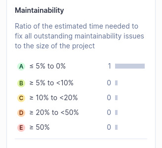
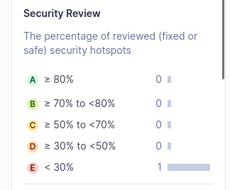
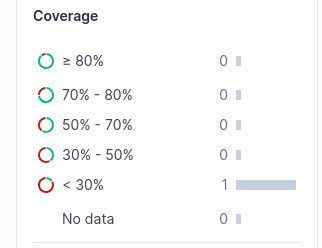
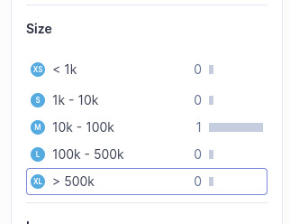
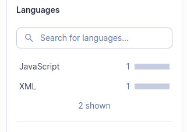

# Confiabilidade – Execução, Análise e Interpretação

## 1. Introdução

Este documento apresenta a execução da avaliação da característica **Confiabilidade**
do projeto **Guardiões da Saúde – App**, conforme o planejamento definido na **Fase 3**.
A avaliação foi conduzida por meio de **análise estática do código-fonte**, visando
coletar métricas objetivas, interpretar resultados e responder às questões do modelo **GQM**.

### Escopo da avaliação

- **Métricas mensuráveis (análise estática):**  
  _Bugs_, _Reliability Rating_, _Code Smells_, _Duplicação_, _Coverage_, _Maintainability_,
  _Security_, _Security Hotspots Reviewed_ e _Tamanho do código (LOC)_.

- **Métricas não mensuráveis (execução em produção / telemetria):**  
  **M1.1 – Availability Rate (%)**, **M2.1 – Erros sem queda**, **M2.2 – Crashes**.

Essas métricas foram classificadas como não mensuráveis pela ausência de ambiente em
produção, telemetria e logs de execução.

---

## 2. Ambiente e Recursos

- **Sistema Operacional:** Ubuntu Linux  
- **Ferramenta de análise:** SonarQube Community Build **v25.11.0.114957**  
- **Modo:** MQR  
- **Scanner:** SonarScanner  
- **Projeto:** `guardioes-app`  
- **URL do painel:** `http://localhost:9000/dashboard?id=guardioes-app&codeScope=overall`  
- **Branch/commit analisado:** *(informar, se aplicável)*

### Evidências
- Diretório de armazenamento: `/docs/assets/images/fase-4/`

---

## 3. Procedimentos Executados (reprodutibilidade)

1. Inicialização do SonarQube (`./sonar.sh start`).  
2. Acesso ao painel web (`http://localhost:9000`).  
3. Criação do projeto e configuração do token.  
4. Execução do **SonarScanner** no repositório clonado.  
5. Processamento de aproximadamente **21.000 linhas de código**.  
6. Registro dos dashboards e métricas.

### Desvios do plano
- Não houve coleta de métricas em produção, conforme previsto na Fase 3.

---

## 4. Evidências e Dados Brutos

- Vídeo Sonar em execução:

  
<strong>Vídeo 1 – Execução do scanner no APP Guardiões da Saúde </strong>

  <video src="../../../assets/evidencias/confiabilidade/sonar.mp4" width="750" controls></video>

  Fonte: Autores Uires Carlos de Oliveira

---
- Prints dos dashboards:
    - Geral / Overview
    

      
<strong>Figura 1 – Visão geral.</strong>

    

    

      
    

    

      Autor(es): <a href="https://github.com/uires2023">Uires Carlos de Oliveira</a>.
    

  ---

## ---------Reliability:-------------------

### Valor coletado:

* 206 bugs
* Reliability Rating: **D**

### Definição:
 * Mede a presença de defeitos com potencial de causar falhas em tempo de execução.

### Critério de avaliação SonarQube:
- A: 0 bugs
- B: ≥ 1 bug low
- C: ≥ 1 bug medium
- D: ≥ 1 bug high
- E: ≥ 1 bug blocker

### Critério de avaliação SonarQube:

- A presença de ao menos um bug de severidade alta (**high**) é suficiente para que o SonarQube classifique a confiabilidade como **D**, independentemente da quantidade total.

### Interpretação no relatório:

> “Alta probabilidade de falhas”

### Concordância
- Sim. A interpretação está correta e segue a lógica da ferramenta.
    
    

      
<strong>Figura 2 – Confiabilidade.</strong>

    

    

      
    

    

      Autor(es): <a href="https://github.com/uires2023">Uires Carlos de Oliveira</a>.
    

    ---
  

## ---------Maintainability:-------------------
### Valor coletado:
* 355 code smells
* Maintainability Rating: **A**
### Definição:
 * Reflete o esforço necessário para corrigir problemas estruturais ou de estilo (code smells), que podem impactar a legibilidade, consistência e manutenção do sistema.
### Critério de avaliação SonarQube:
 * Baseado no índice de dívida técnica (Technical Debt Ratio):
\[
\text{(tempo estimado para correção / tempo de desenvolvimento)} \times 100
\]
* Classificação:
- A: ≤ 5%
- B: ≤ 10%
- C: ≤ 20%
- D: ≤ 50%
- E: > 50%
### Justificativa técnica:
- Apesar do número elevado de *code smells*, o esforço estimado de correção ficou abaixo de 5% do esforço total de desenvolvimento, o que garante a nota **A**.
### Interpretação no relatório:
> “Esforço baixo de correção”
### Concordância
- Sim. A análise foi feita com base nos critérios corretos.

    

      
<strong>Figura 3 – Manutenibilidade.</strong>

    

    

      
    

    

      Autor(es): <a href="https://github.com/uires2023">Uires Carlos de Oliveira</a>.
    

    ---

## ---------Security:-------------------
### Valor coletado:
* Security Rating: **A**
### Definição:
 * Avalia a presença de vulnerabilidades de segurança reais no código.
### Critério de avaliação SonarQube:
 * A: Nenhuma vulnerabilidade real;
 * D ou E: Presença de vulnerabilidades críticas
### Justificativa técnica:
- O Sonar não identificou falhas de segurança reais — apenas mensagens informativas — o que justifica a nota máxima **A**.
### Interpretação no relatório:
> “Sem vulnerabilidades críticas”
### Concordância
- Sim. Condiz com o funcionamento da métrica.

    

      
<strong>Figura 4 – Security</strong>

    

    

      
    

    

      Autor(es): <a href="https://github.com/uires2023">Uires Carlos de Oliveira</a>.
    

    ---

## ---------Security Hotspots:-------------------
### Valor coletado:
* 0% revisado
* Classificação: **E**
### Definição:
 * Aponta trechos do código potencialmente sensíveis à segurança que exigem análise manual para confirmação de risco.
### Critério de avaliação SonarQube:
 * A: ≥ 80% revisado
 * E: < 30% revisado
### Justificativa técnica:
- Nenhum dos pontos sinalizados foi revisado manualmente, o que acarreta automaticamente nota **E**.
### Interpretação no relatório:
> “Risco não revisado”
### Concordância
 - Sim. Está de acordo com o critério da ferramenta

     

      
<strong>Figura 5 – Security Hotspots</strong>

    

    

      
    

    

      Autor(es): <a href="https://github.com/uires2023">Uires Carlos de Oliveira</a>.
    

    ---

## ---------Coverage:-------------------
### Valor coletado:
* 0%
* Classificação: **E**
### Definição:
 * Mede a porcentagem de linhas de código cobertas por testes automatizados (unitários ou de integração).
### Critério de avaliação SonarQube:
 * A: ≥ 80%
 * E: < 30%
### Justificativa técnica:
- O projeto não possui testes automatizados com cobertura mensurável, o que justifica a nota mínima **E**.
### Interpretação no relatório:
> “Ausência de testes”
### Concordância
 - Sim. A descrição está alinhada com a avaliação do SonarQube.

    

      
<strong>Figura 6 – Coverage</strong>

    

    

      
    

    

      Autor(es): <a href="https://github.com/uires2023">Uires Carlos de Oliveira</a>.
    

    ---

## ---------Duplications:-------------------
   
   

     
<strong>Figura 7 – Duplicações de Código.</strong>

    

    

     
    

    

      Autor(es): <a href="https://github.com/uires2023">Uires Carlos de Oliveira</a>.
    

    ---

## ---------Size:-------------------
   

      
<strong>Figura 8 – Size</strong>

    

    

      
    

    

      Autor(es): <a href="https://github.com/uires2023">Uires Carlos de Oliveira</a>.
    

  ---
  
## ---------Languages:-------------------
   

      
<strong>Figura 9 – Languages</strong>

    

    

      
    

    

      Autor(es): <a href="https://github.com/uires2023">Uires Carlos de Oliveira</a>.
    

- Local: `/docs/assets/images/fase-4/`
- Planilhas/relatórios adicionais: *(não aplicável, se não houver)*

---

## 5. Métricas Coletadas

| Métrica | Valor | Evidência | Interpretação | Julgamento |
| --- | --- | --- | --- | --- |
| Bugs | 206 | Dashboard / Reliability | Volume alto de defeitos | Ruim |
| Reliability Rating | D | Aba Reliability | Alta probabilidade de falhas | Ruim |
| Code Smells | 355 | Dashboard | Qualidade interna baixa | Regular → Ruim |
| Duplicação | 39,1% | Aba Duplications | Código excessivamente repetido | Péssimo |
| Cobertura | 0% | Aba Coverage | Ausência de testes | Péssimo |
| Maintainability Rating | A | Aba Maintainability | Esforço baixo de correção | Excelente |
| Security Rating | A | Aba Security | Sem vulnerabilidades críticas | Excelente |
| Hotspots revisados | 0% (E) | Aba Security Hotspots | Risco não revisado | Ruim |
| Tamanho (LOC) | ~21k | Aba Size | Alta densidade de problemas | Contextual |

---

### 5.1 Métricas não mensuráveis

Conforme definido no planejamento da **Fase 3**, algumas métricas dependem de ambiente em produção ou de informações técnicas que não estão disponíveis para a equipe de avaliação. Por esse motivo, não foi possível mensurá-las nesta fase.

- **M1.1 – _Availability Rate_ (%)**  
  Para medir a disponibilidade seria necessário monitorar o endpoint principal do sistema. No entanto, a documentação consultada não apresentou o endpoint oficial da aplicação, o que impossibilitou a configuração de ferramentas de monitoramento, como o UptimeRobot. Uma alternativa seria utilizar ferramentas externas de inspeção de tráfego, como o Fiddler, para tentar identificar o endpoint real. Ainda assim, mesmo que esse endpoint fosse descoberto, seria indispensável a confirmação da equipe de desenvolvimento para validar se ele corresponde de fato ao ambiente de produção. Sem essa validação, os dados obtidos não poderiam ser considerados confiáveis.

- **M2.1/M2.2 – Erros sem queda (_runtime_) e Erros com queda (_Crashes_)**  
  Para avaliar a tolerância a falhas seria necessário acesso direto ao código em execução ou aos logs de produção, o que não estava disponível para a equipe de avaliação. Uma alternativa seria solicitar à equipe de desenvolvimento que configurasse ferramentas de monitoramento, como o Sentry, para registrar erros e falhas. No entanto, devido ao tempo reduzido para a execução da avaliação, não foi viável abrir essa solicitação e aguardar a implementação. Por esse motivo, a métrica foi declarada como não mensurável nesta fase.

---

## 6. Respostas às Questões GQM

### Q1 — O sistema está disponível para uso na maior parte do tempo?
- **Resposta:** Não mensurável.  
- **Justificativa:** A ausência de informações sobre o endpoint oficial impossibilitou a configuração de monitoramento de disponibilidade. Embora seja tecnicamente possível descobrir o endpoint por meio de ferramentas externas usando o Fiddler, por exemplo, seria necessária a validação da equipe de desenvolvimento para garantir que o monitoramento reflita o ambiente real de produção. Sem essa confirmação, os dados não podem ser considerados confiáveis.

### Q2 — O sistema continua operando diante de falhas parciais?
- **Resposta:** Não.  
- **Evidências:** duplicação (39,1%), 355 _smells_, 0% de cobertura, _high issue_ e _rating_ D.

### Q3 — O sistema apresenta baixa incidência de _bugs_?
- **Resposta:** Não.  
- **Evidências:** 206 _bugs_ e _Reliability Rating_ = D.

---

## 7. Conclusão e Recomendações

### Síntese
A **Confiabilidade** é considerada **baixa**, devido ao alto volume de defeitos,
duplicação elevada e ausência de testes automatizados.

### Ações priorizadas
1. Implementar testes automatizados (unitários e integração).  
2. Reduzir duplicação por refatoração.  
3. Priorizar correção de _bugs_ críticos e *high*.  
4. Tratar _code smells_ de maior impacto.  
5. Revisar manualmente _security hotspots_.

---

## 8. Histórico de Versões

| Versão | Data       | Descrição | Autor |
| ------ | ---------- | --------- | ----- |
| `1.0`  | 25/11/2025 | Execução da Avaliação – Confiabilidade | [Uires Carlos de Oliveira](https://github.com/uires2023) |
| `1.1`  | 26/11/2025 | Adiciona a conclusão sobre as métricas não mensuráveis | [Matheus Henrick](https://github.com/MatheusHenrickSantos) |
| `1.2` | 27/11/2025 | Execução e análise (SonarQube v25.11.0.114957) | Uires Carlos de Oliveira |
| `1.3`  | 28/11/2025 | Adiciona novamente a conclusão sobre as métricas não mensuráveis e adiciona imagens de evidências | [Matheus Henrick](https://github.com/MatheusHenrickSantos) |
