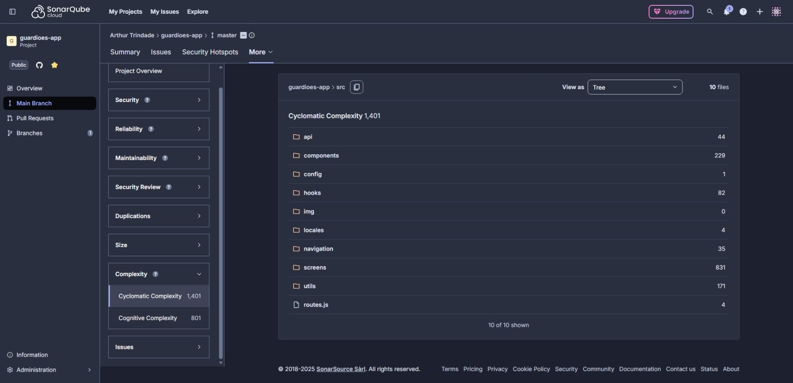

# 2. Manutenibilidade – Execução da Avaliação

## 2.1 Introdução
Esta seção apresenta a execução do plano definido na Fase 3 para a característica **Manutenibilidade** do Guardiões da Saúde – App. As métricas previstas na Fase 2 (M1.1, M2.1, M2.2, M3.1, M4.1, M4.2) foram operacionalizadas conforme o planejamento, com foco em:

- avaliar a **complexidade estrutural** do código;
- verificar **acoplamento** e **ciclos de dependência**;
- medir a **cobertura de testes automatizados**;
- analisar a **disponibilidade** e a **qualidade** da documentação técnica.

Sempre que possível, as métricas foram coletadas de forma automatizada com apoio de ferramentas (SonarCloud, Jest). Nos casos em que a métrica não é suportada pela ferramenta utilizada, a impossibilidade de coleta foi registrada e discutida na análise.

---

## 2.2 Ambiente e Recursos

### 2.2.1 Código-fonte analisado

- **Projeto:** Guardiões da Saúde – App.
- **Repositório de origem:** fork a partir do [repositório oficial da ProEpi](https://github.com/ProEpiDesenvolvimento).
- **Branch analisada:** `master`.

### 2.2.2 Ambiente de execução local

- **Sistema Operacional:** Windows 11 25H2.
- **Terminal utilizado:** PowerShell.
- **Node.js / npm:** Node v20.14.0 e npm 10.7.0.
- **Navegador:** Edge para acesso ao SonarCloud.

---

## 2.3 Procedimentos Executados (reprodutibilidade)
A seguir são descritos, para cada métrica, o procedimento efetivamente executado, observações relevantes e as principais evidências geradas.

### 2.3.1 M1.1 – Complexidade Ciclomática

**Questão relacionada:** Q1 – Qual o nível de complexidade estrutural do código-fonte do sistema?

#### 2.3.1.1 Procedimento executado

1. Acessar o projeto `guardioes-app` no SonarCloud.
2. Selecionar a branch `master`.
3. Abrir o menu **Complexity** e, em seguida, a aba **Cyclomatic Complexity**.
4. Na visão em árvore, registrar:
   - **Complexidade total do projeto** (valor exibido no topo).
   - Complexidade agregada por diretório/arquivo, com foco em:
     - pasta `src/` (código principal do app);
5. Registrar os valores coletados na planilha de evidências.

#### 2.3.1.2 Resultados

A análise de complexidade ciclomática realizada no SonarCloud apresentou os seguintes valores:

- **Complexidade ciclomática total do projeto:** 1.419  
- **Complexidade concentrada na pasta `src/`:** 1.401  
- **Complexidade dos arquivos fora de `src/`:** baixa, variando entre 1 e 10

Esses valores indicam que praticamente toda a complexidade estrutural relevante do aplicativo está localizada dentro das pastas internas do código-fonte principal.

#### 2.3.1.3 Observações

O SonarCloud não disponibiliza métricas detalhadas de complexidade para projetos JavaScript em nível de método ou função individual, tais como complexidade média por método, complexidade máxima ou listagem de funções com complexidade acima de limiares específicos (10, 20, 30). Assim, a avaliação da complexidade ciclomática foi conduzida no nível de pastas e arquivos, com foco principal na pasta `src/`, onde se concentra a maior parte da lógica do aplicativo.

A distribuição observada sugere que a estrutura modular do projeto não é equilibrada em termos de complexidade, alguns diretórios acumulam a maior parte dos caminhos independentes do sistema, o que pode indicar a presença de componentes muito grandes, telas com múltiplas responsabilidades ou hooks utilitários extensos.

#### 2.3.1.4 Evidências

<div align="center">
  <p><strong>Figura 1 – Visão de complexidade ciclomática no SonarCloud (árvore de arquivos).</strong></p>
</div>
<div align="center">
  
</div>
<div align="center" style="font-size: 12px; font-style: italic;">
  Fonte: Autores.
</div>

<div align="center">
  <p><strong>Vídeo 1 – Navegação no SonarCloud para coleta da complexidade.</strong></p>
</div>
<div align="center">
  <video src="../../../assets/evidencias/manutenabilidade/m11_sonar_complexity.mp4" width="750" controls></video>
</div>
<div align="center" style="font-size: 12px; font-style: italic;">
  Fonte: Autores.
</div>


---

### 2.3.2 M2.1 – Nível de Acoplamento entre Módulos

**Questão relacionada:** Q2 – As responsabilidades dos módulos estão bem separadas?

#### 2.3.2.1 Observações

O SonarCloud limita sua análise estrutural para projetos JavaScript, não oferecendo mecanismos automáticos para mapear relações entre módulos ou determinar acoplamento estrutural.  
Ferramentas assim só estão disponíveis para linguagens como Java, C#, C/C++, Kotlin e outras que possuem modelos de AST mais completos.

Apesar disso, é possível inferir indiretamente que o projeto apresenta um grau elevado de dependências internas devido ao grande número de arquivos em `src/`, porém tal conclusão não pode ser quantificada pela ferramenta.

Assim, esta métrica foi registrada como **não mensurável via SonarCloud**, com justificativa técnica e evidência correspondente.

---

### 2.3.3 M2.2 – Detecção de Ciclos de Dependência

**Questão relacionada:** Q2 – As responsabilidades dos módulos estão bem separadas?

#### 2.3.3.1 Observações

Na implementação atual da análise para JavaScript, o SonarCloud não constrói um grafo de dependências capaz de identificar ciclos entre módulos. Essa limitação está documentada nas próprias notas de suporte da ferramenta para linguagens interpretadas.

Apesar de não ser possível medir ciclos, não foram observados indícios manuais de ciclo (como imports recursivos óbvios).  
Ainda assim, a métrica foi classificada como **“não mensurável”** devido à impossibilidade técnica de detecção automatizada.

---

### 2.3.4 M3.1 – Cobertura de Testes Automatizados

**Questão relacionada:** Q3 – O código está suficientemente coberto por testes automatizados?

#### 2.3.4.1 Procedimento executado

1. Na raiz do projeto `guardioes-app`, executar:
   ```bash
   npm test -- --coverage
   ```
2. Confirmar o resultado da execução de testes no terminal (1 suíte/1 teste passando).

3. Registrar o arquivo `coverage/lcov-report/index.html` no navegador.

#### 2.3.4.2 Resultados

A execução da suíte de testes via Jest gerou:

- **Testes executados com sucesso:** 1 teste (exemplo padrão do React Native);
- **Cobertura total reportada:** **0%** em todas as dimensões  
  (statements, branches, lines, functions);
- **Número de arquivos analisados:** 3.308 declarações avaliadas.

Apesar de o Jest ter rodado corretamente, **nenhum dos arquivos de `src/` foi coberto**, resultando em cobertura total igual a zero.

#### 2.3.4.3 Observações

Mesmo com a execução bem-sucedida do Jest, a estrutura do projeto não contém testes para componentes, telas, hooks ou utilitários, apenas o teste gerado automaticamente pelo template do React Native.

#### 2.3.4.4 Evidências

<div align="center">
  <p><strong>Figura 2 – Relatório completo de cobertura do Jest exibindo 0%.</strong></p>
</div>
<div align="center">
  
</div>
<div align="center" style="font-size: 12px; font-style: italic;">
  Fonte: Autores.
</div>

<div align="center">
  <p><strong>Vídeo 2 – Execução do comando <code>npm test -- --coverage</code> mostrando a geração do relatório.</strong></p>
</div>
<div align="center">
  <video src="../../../assets/evidencias/manutenabilidade/m31_jest_run.mp4" width="750" controls></video>
</div>
<div align="center" style="font-size: 12px; font-style: italic;">
  Fonte: Autores.
</div>


---

### 2.3.5 M4.1 – Disponibilidade da Documentação

**Questão relacionada:** Q4 – A documentação técnica existente é suficiente para apoiar futuras manutenções?

#### 2.3.5.1 Procedimento executado

1. Abrir o repositório `guardioes-app` no VSCode/GitHub.
2. Inspecionar a raiz do projeto e a pasta `doc/`, verificando a presença dos artefatos definidos na Fase 3.
3. Registrar, em checklist, **Sim / Não / Parcial** para cada artefato e o respectivo caminho.

#### 2.3.5.2 Resultados

A inspeção do repositório identificou os seguintes artefatos:

<div align="center">
  <p><strong>Tabela 1 – Artefatos de documentação identificados no repositório do Guardiões da Saúde.</strong></p>
</div>

| Documento | Presença | Caminho |
|-----------|----------|---------|
| README principal | **Sim** | `/README.md` |
| Documento de arquitetura | **Não** | — |
| Documentação de API | **Não** | — |
| Guia de contribuição | **Sim** | `/CONTRIBUTING.md` |
| Documentação técnica em `/docs` | **NÃO** | `/docs` |


<div align="center" style="font-size: 12px; font-style: italic;">
  Fonte: Autores.
</div>

Conclusão: **Documentação disponível: Parcial**

#### 2.3.5.3 Observações

O repositório possui uma boa base de arquivos voltados à colaboração (issues, PRs, código de conduta), mas **carece totalmente de documentação técnica do sistema**, incluindo:

- visão geral de arquitetura,
- descrição de módulos,
- fluxos internos,
- modelos de dados,
- contratos de API.

Isso impacta diretamente a mantenibilidade, pois novos desenvolvedores precisam explorar manualmente o código para compreender suas responsabilidades e dependências.

---

### 2.3.6 M4.2 – Qualidade da Documentação

**Questão relacionada:** Q4 – A documentação técnica existente é suficiente para apoiar futuras manutenções?

#### 2.3.6.1 Procedimento executado

1. Considerar os artefatos identificados na M4.1:
      - `README.md`
      - `CONTRIBUTING.md`
2. Para cada documento, aplicar o checklist definido na Fase 3, atribuindo notas de **1 a 5** para:
    - **Clareza**
    - **Completude**
    - **Atualização**
3. Calcular a média das três notas para cada artefato.
4. Classificar a qualidade geral de cada documento:
    - 4–5: Boa
    - 3: Regular
    - 1–2: Ruim

#### 2.3.6.2 Resultados

Cada documento identificado em M4.1 foi avaliado segundo os critérios: **clareza**, **completude** e **atualização**, com notas de 1 a 5.

<div align="center">
  <p><strong>Tabela 2 – Avaliação de clareza, completude e atualização da documentação.</strong></p>
</div>

| Documento | Clareza | Completude | Atualização | Média |
|-----------|--------:|-----------:|------------:|------:|
| README.md | 4 | 2 | 3 | **3,0** |
| CONTRIBUTING.md | 4 | 3 | 3 | **3,3** |
| Templates de Issue/PR | 4 | 4 | 4 | **4,0** |


<div align="center" style="font-size: 12px; font-style: italic;">
  Fonte: Autores.
</div>

Média geral ponderada da documentação técnica: **3,1 (Regular)**

#### 2.3.6.3 Observações

A documentação voltada ao fluxo de contribuição apresenta boa clareza e está relativamente atualizada, mas representa apenas o aspecto colaborativo do projeto.  
Não há documentação técnica profunda, o que reduz significativamente a completude geral.  

A ausência de descrição de arquitetura e módulos impacta a nota final, resultando em uma avaliação **regular**, com necessidade de expansão futura.

#### 2.3.6.4 Evidências

<div align="center">
  <p><strong>Figura 3 – Documentação do Guardiões da Saúde.</strong></p>
</div>
<div align="center">
  
</div>
<div align="center" style="font-size: 12px; font-style: italic;">
  Fonte: Autores.
</div>

---

## 2.4 Métricas Coletadas

<div align="center">
  <p><strong>Tabela 3 – Síntese das métricas de manutenibilidade coletadas.</strong></p>
</div>

| Métrica | Valor | Evidência | Interpretação | Julgamento |
| --- | --- | --- | --- | --- |
| **M1.1 – Complexidade Ciclomática** | Complexidade total: **1.419** | Print/relatório do SonarCloud | Complexidade elevada e concentrada em `src/`, dificultando manutenção e extensão do código. | **Insuficiente** |
| **M3.1 – Cobertura de Testes Automatizados (%)** | **0%** | Relatório completo do Jest (coverage) | Não há testes cobrindo o código crítico da aplicação, aumentando risco de regressões. | **Insuficiente** |
| **M4.1 – Disponibilidade da Documentação** | **Parcial** | Checklist dos artefatos identificados | Documentação colaborativa existe, mas documentação técnica é ausente. | **Regular** |
| **M4.2 – Qualidade da Documentação** | Média geral: **3,1** | Planilha de notas (clareza/completude/atualização) | Documentação clara, mas incompleta e pouco técnica; insuficiente para onboarding e manutenção. | **Regular** |

<div align="center" style="font-size: 12px; font-style: italic;">
  Fonte: Autores.
</div>

### 2.4.1 Métricas não mensuráveis

Diferentemente do previsto no planejamento, **duas métricas não puderam ser mensuradas** devido a limitações técnicas do SonarCloud para projetos JavaScript/React Native:

- **M2.1 – Acoplamento**  
- **M2.2 – Ciclos de dependência**

Ambas foram devidamente justificadas nas suas seções e registradas como **não mensuráveis**.

---

## 2.5 Respostas às Questões GQM

- **Q1. Qual o nível de complexidade estrutural do código-fonte do sistema?**  
    - **Resposta:** **Alto**  
    - **Justificativa:** a complexidade total de **1.419**, concentrada quase totalmente na pasta `src/`, indica elevado número de caminhos independentes e módulos extensos, tornando o código mais difícil de compreender e modificar.

- **Q2. As responsabilidades dos módulos estão bem separadas?**  
    - **Resposta:** **Não é possível afirmar**  
    - **Justificativa:** as métricas de acoplamento (M2.1) e ciclos (M2.2) não puderam ser medidas no SonarCloud para JavaScript. Não foram identificados ciclos manualmente, mas a ausência de ferramentas torna a avaliação inconclusiva.

- **Q3. O código está suficientemente coberto por testes automatizados?**  
    - **Resposta:** **Não**  
    - **Justificativa:** a métrica M3.1 apontou **0%** de cobertura, indicando que funcionalidades críticas não possuem testes e que não há apoio automatizado para evitar regressões.

- **Q4. A documentação técnica existente é suficiente para apoiar futuras manutenções?**  
    - **Resposta:** **Parcialmente**  
    - **Justificativa:** a documentação disponível cobre aspectos colaborativos (issues, PRs, código de conduta), porém **não existe documentação técnica**, reduzindo completude e sustentação ao processo de manutenção (M4.1 e M4.2).


---

## 2.6 Conclusão e Recomendações
As conclusões consolidadas sobre Manutenibilidade e as recomendações prioritárias estão apresentadas de forma integrada na [Conclusão Geral da Fase 4](conclusao_geral.md).

---

## 2.7 Histórico de Versões
| Versão | Data       | Descrição                      | Autor(es) |
| ------ | ---------- | ------------------------------ | --------- |
| `1.0`  | 26/11/2025 | Criação do documento           | [Arthur Carneiro](https://github.com/trindadea) |
| `1.1`  | 27/11/2025 | Preenchimento da Fase 4        | [Arthur Carneiro](https://github.com/trindadea) |
| `1.2`  | 27/11/2025 | Adição das evidências | [Gabriela Tiago](https://github.com/GabrielaTiago) |
| `1.3`  | 27/11/2025 | Revisão e Ajustes | [Gabriela Tiago](https://github.com/GabrielaTiago) |
